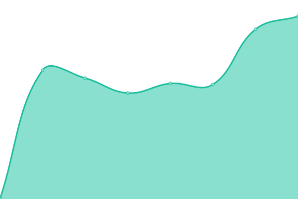

# [📈 Live Status](https://sundaylab.github.io/upptime): <!--live status--> **🟩 All systems operational**

This repository contains the open-source uptime monitor and status page for [Daniel Hogrebe](http://www.sundaylab.de), powered by [Upptime](https://github.com/upptime/upptime).

With [Upptime](https://upptime.js.org), you can get your own unlimited and free uptime monitor and status page, powered entirely by a GitHub repository. We use [Issues](https://github.com/sundaylab/upptime/issues) as incident reports, [Actions](https://github.com/sundaylab/upptime/actions) as uptime monitors, and [Pages](https://sundaylab.github.io/upptime) for the status page.

<!--start: status pages-->
<!-- This summary is generated by Upptime (https://github.com/upptime/upptime) -->
<!-- Do not edit this manually, your changes will be overwritten -->
<!-- prettier-ignore -->
| URL | Status | History | Response Time | Uptime |
| --- | ------ | ------- | ------------- | ------ |
|  [Sunday Lab](https://www.sundaylab.com) | 🟩 Up | [sunday-lab.yml](https://github.com/doosom/upptime/commits/HEAD/history/sunday-lab.yml) | 

 534ms
     
 | 

<a href="https://doosom.github.io/upptime/history/sunday-lab">100.00%</a>
    

|  [Latitas](https://www.latitas-online.es) | 🟩 Up | [latitas.yml](https://github.com/doosom/upptime/commits/HEAD/history/latitas.yml) | 

 1321ms
     
 | 

<a href="https://doosom.github.io/upptime/history/latitas">100.00%</a>
    

|  [Regalos](https://www.regalos-publicidad.es) | 🟩 Up | [regalos.yml](https://github.com/doosom/upptime/commits/HEAD/history/regalos.yml) | 

 860ms
     
 | 

<a href="https://doosom.github.io/upptime/history/regalos">100.00%</a>
    

<!--end: status pages-->

[**Visit our status website →**](https://sundaylab.github.io/upptime)

## 📄 License

- Powered by: [Upptime](https://github.com/upptime/upptime)
- Code: [MIT](./LICENSE) © [Daniel Hogrebe](http://www.sundaylab.de)
- Data in the `./history` directory: [Open Database License](https://opendatacommons.org/licenses/odbl/1-0/)
